# Analise explioratoria do consumo de energia elétrica no Brasil 

O estudo tem por objetivo analisar o consumo de energia elétrica no Brasil ao longo dos anos, identificando padrões, variações regionais e tipos de consumo, com base em dados oficiais.

##### Importação de Bibliotecas
Foram utilizadas bibliotecas amplamente aceitas para análise de dados (pandas, numpy) e visualização (matplotlib, seaborn). Além disso, o notebook utiliza funções personalizadas criadas nos módulos visualization, grafico e cleaning.
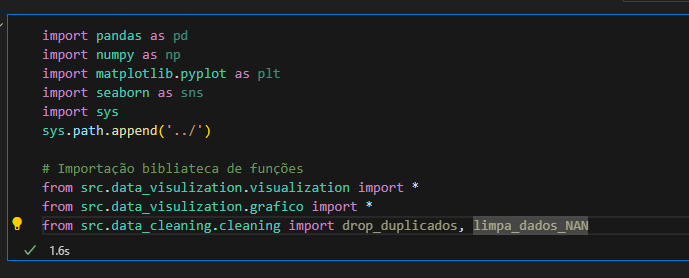

##### Carregamento dos dados

 > Dataset com dados do IBGE coletado no endereço ("https://www.kaggle.com/datasets/crisparada/brazilian-cities/versions/7?resource=download&select=BRAZIL_CITIES.csv")
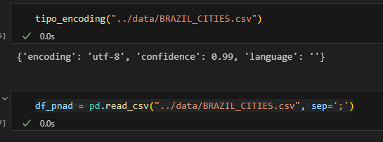

* União dos Datasets
> União dos dados dataset (Consumo de energia e estados)
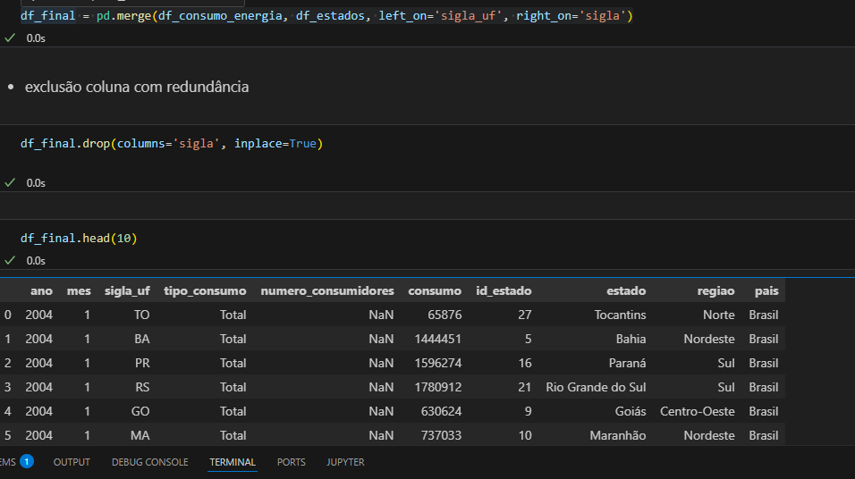
> União dos dados do df_final com os dados do dataset do IBGE, que foram coletado no endereço ("https://www.kaggle.com/datasets/crisparada/brazilian-cities/versions/7?resource=download&select=BRAZIL_CITIES.csv")
 

##### Criação de Funções de Visualização e Análise Gráfica
A estrutura do projeto foi organizada em módulos reutilizáveis, permitindo separar responsabilidades e tornar o código mais limpo, reutilizável e fácil de manter.
> Funções de Limpeza de Dados - cleaning.py
Esses métodos foram utilizados para garantir a integridade dos dados, antes de qualquer análise ou visualização.
Remove duplicatas do DataFrame original inplace.
> * def drop_duplicados(dataframe: pd.DataFrame) -> pd.DataFrame:
Remove todas as linhas com valores ausentes (NaN).
> * def limpa_dados_NAN(dataframe: pd.DataFrame) -> pd.DataFrame:

> Diagnóstico de Dados e Outliers - visualization.py
Ferramentas de apoio para, Visualizar registros duplicados ou ausentes, Verificar codificação de arquivos, Detectar outliers com base no método IQR
def visuliza_duplicados(dataframe: pd.DataFrame, subset=None)
def visuliza_dados_NaN(dataframe: pd.DataFrame)
def tipo_encoding(caminho)
def detectar_outliers_iqr(df, coluna, ano)

> Visualizações Personalizadas
def grafico_consumo_por_ano_estados(df, ano)
def grafico_consumo_por_estado(df, sigla_uf)
def grafico_consumo_mensal_por_estado(df, sigla_uf, ano)
def consumidores_por_regiao_ano(df, ano_escolhido)
def correlacao_consumo_consumidores_por_estado(df, estado_escolhido)
def detectar_outliers_consumo_iqr(df)
def plotar_outliers_boxplot(df, estado, ano)
def top10_consumo_estados_ano(df, ano_escolhido)
def mapa_calor_correlacao(df)
> * Este módulo agrupa todas as visualizações utilizadas no projeto, com foco em (Comparações regionais e temporais, Correlação entre variáveis, Detecção visual de outliers,
Evolução e ranking de consumo)

##### Limpeza e tratamento dos dados
* Verificação do formato:
> 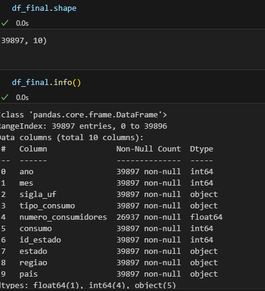 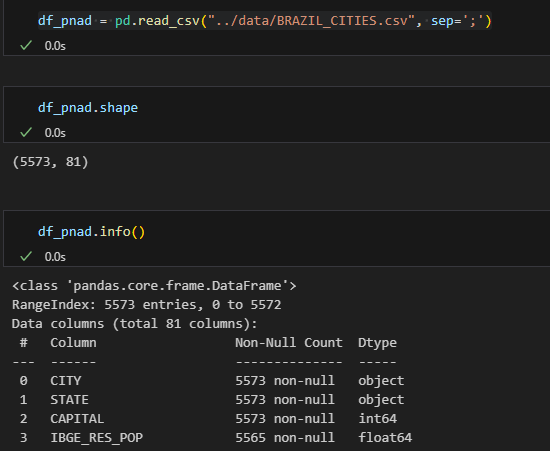

* Remoção de dados ausentes

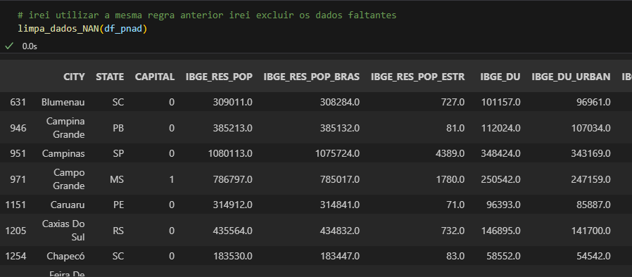
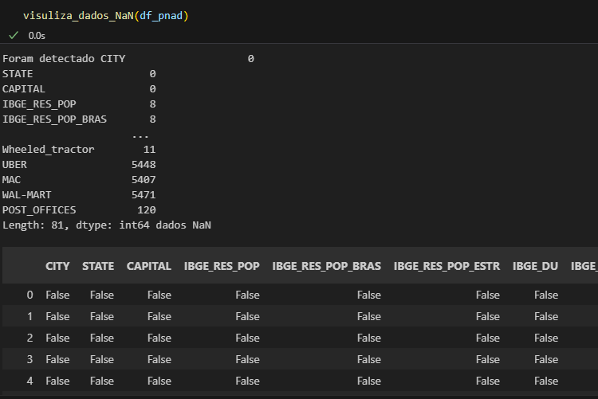
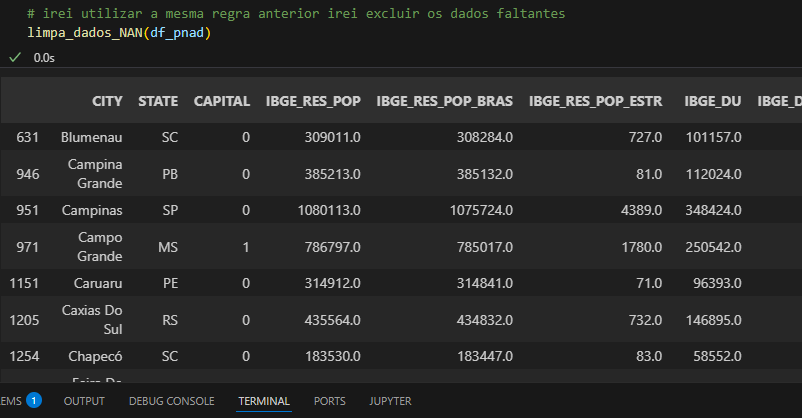

* Verificação e remoção de duplicatas:
> Visualização 
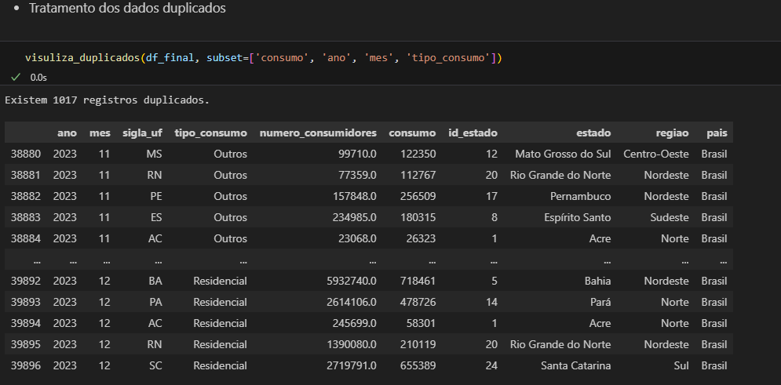

> Remoção - Foi optado por realizar a exclusão dos dados duplicado, assim obdecendo os mesmo criterio utilizado no tratamento dos dados ausentes
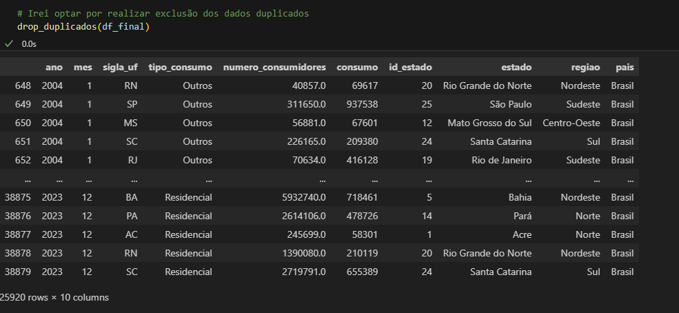

##### Análises Iniciais
* Distribuição por ano:
> 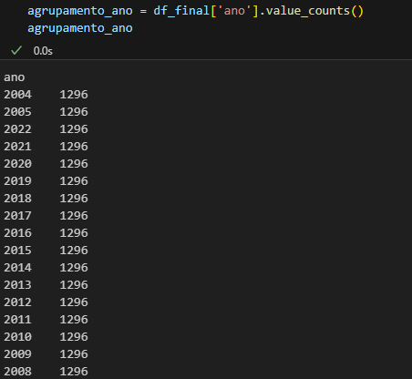

* Distribuição por tipo de consumo:
> 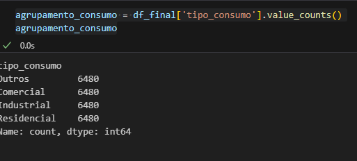 

* Correlação entre Variáveis - Avaliação da relação entre variáveis numéricas, especialmente entre consumo e outras dimensões temporais ou regionais:
>
>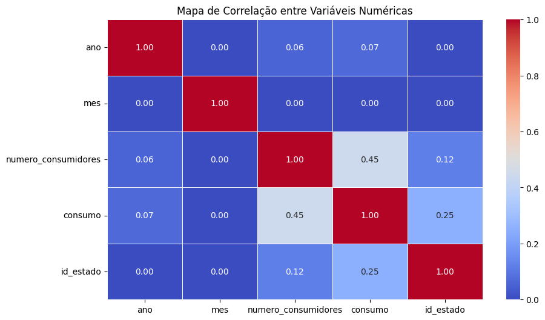
 Demonstrando consumo está correlacionado com o número de consumidores, como esperado. Outras correlações menores podem indicar sazonalidades ou padrões regionais.

### Síntese dos Principais Insights 

1º  Evolução do consumo total por ano (nacional).
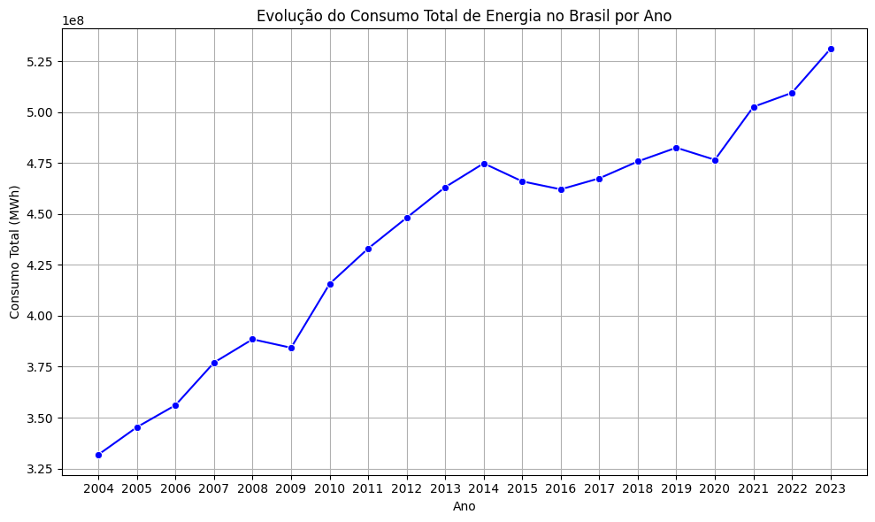

O gráfico acima evidencia que o Brasil tem tido uma demanda energética crescente, o que pode estar relacionado ao aumento populacional, expansão industrial e urbanização.
O grafico demonstra Como o consumo de energia evoluiu ano a ano no país, Tendências de crescimento ou queda, Anos de estabilidade, crescimento rápido ou crises.

2º Comparação do consumo por região ao longo dos anos 

O Sudeste lidera com folga no consumo energético, refletindo sua importância econômica e demográfica.
As demais regiões mostram crescimento contínuo, evidenciando desenvolvimento econômico e populacional mais equilibrado no país ao longo do tempo.
A redução ou estabilização temporária do consumo em algumas regiões entre 2014–2017 e 2019–2020 pode indicar impactos econômicos (crises e pandemia).

3º Consumo médio mensal por região, filtrado por um ano

O Sudeste consome cerca de 5 a 6 vezes mais energia que o Norte, reforçando desigualdades regionais no consumo.
O padrão de sazonalidade (variações mensais) é discreto, mas pode indicar influências climáticas ou econômicas.
A leve queda de consumo no Sul entre maio e setembro pode estar relacionada à redução de atividades agrícolas ou industriais em períodos de clima mais rigoroso.

4º Tendência de consumo mensal por ano em uma região específica
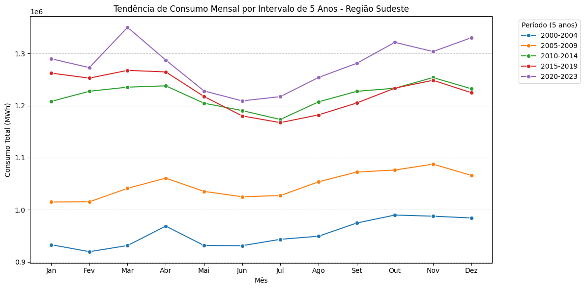

O gráfico evidencia uma tendência clara de aumento do consumo na região Sudeste ao longo dos anos. O aumento gradual e consistente do consumo ao longo dos períodos reflete:
Crescimento populacional e urbano;
Expansão da atividade econômica e industrial;
Aumento da penetração de equipamentos elétricos e ar-condicionado;
O padrão de consumo mais elevado nos meses de março/abril e setembro/outubro pode estar associado a períodos de transição climática, que exigem mais energia (resfriamento ou aquecimento);
A redução entre junho e julho é comum entre os períodos, sugerindo possível sazonalidade econômica ou climática.

5º Consumo por tipo de consumo ao longo dos anos

O gráfico apresenta a evolução do consumo de energia elétrica no Brasil, de 2004 a 2023, dividido por tipo de consumo: Industrial, Residencial, Comercial e Outros.
Industrial: Lidera o consumo ao longo de todo o período, com oscilações entre 2009 e 2020, mas retomada e crescimento até 2023.
Residencial: Crescimento constante e expressivo, ultrapassando 160 milhões de MWh em 2023.
Comercial: Evolução constante até 2014, leve queda entre 2015 e 2020, retomando o crescimento a partir de 2021.
Outros: Menor consumo entre os grupos, mas com crescimento gradual e estabilidade nos últimos anos.

6º Distribuição do número de consumidores por Região

gráfico mostra a distribuição do número total de consumidores de energia elétrica por região em 2010:
1º Sudeste lidera com 368 milhões de consumidores.
2º Nordeste vem em segundo, com 206 milhões.
3º Sul ocupa o terceiro lugar, com 121 milhões.
Centro-Oeste registra 59 milhões, e Norte tem o menor número, com 45 milhões.
O Sudeste concentra a maior parte dos consumidores, refletindo sua densidade populacional e desenvolvimento urbano.

7º Correlação entre número de consumidores e consumo total por estado

O estado de São Paulo mostra uma relação positiva entre o número total de consumidores e o consumo total de energia (em MWh) ao longo dos anos (2012-2022). A dispersão de pontos indica um aumento geral de ambos os valores, com uma linha de regressão vermelha confirmando a tendência ascendente. A grade no fundo facilita a leitura, e o título destaca o foco em São Paulo, sugerindo uma forte correlação entre o crescimento do número de consumidores e o consumo energético no estado.

8º Detecção de outliers no consumo por estado e ano (usando IQR)
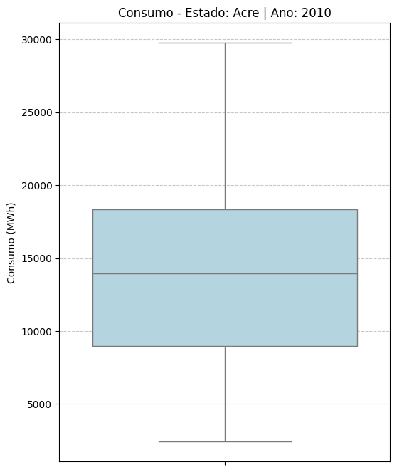

O gráfico de boxplot gerado para o estado do Acre em 2010 exibe a distribuição do consumo de energia, não destacando possíveis outliers. A caixa central mostra os quartis (Q1, mediana e Q3), com os "whiskers" indicando o intervalo interquartil (IQR). Pontos fora desse intervalo são marcados como outliers, sugerindo valores de consumo atipicamente altos ou baixos para o Acre nesse ano. A visualização é clara, com o foco no estado e ano especificados.

9º Estados que mais consomem energia

O gráfico do ano de 2015, exibe os 10 estados com maior consumo total de energia (em MWh), destacando São Paulo (SP) no topo, seguido por outros estados como Rio de Janeiro (RJ) e Minas Gerais (MG). As barras, coloridas pela paleta "mako", mostram uma variação significativa no consumo, com valores anotados acima de cada barra para clareza. Os rótulos dos estados estão rotacionados a 45 graus no eixo x, e uma grade no eixo y facilita a comparação, indicando uma concentração de consumo nos estados do Sudeste.

10º Mapa de calor da correlação entre variáveis numéricas (consumo, consumidores)
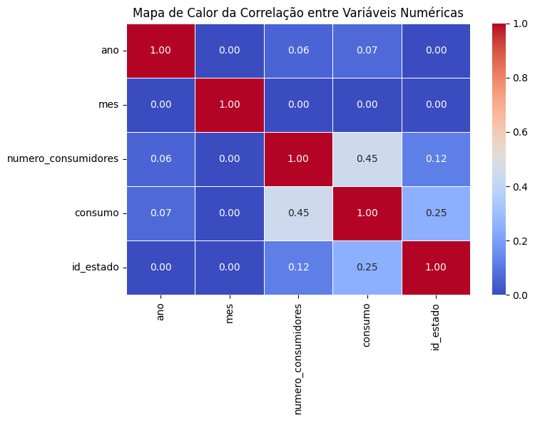

O gráfico de correlação para o estado de São Paulo mostra uma dispersão de pontos que representa a relação entre o número total de consumidores e o consumo total de energia (em MWh) ao longo dos anos (2012-2022). Uma linha de regressão vermelha indica uma tendência positiva e crescente, sugerindo uma forte correlação entre o aumento de consumidores e o consumo. Os pontos, com tamanho moderado e transparência, são distribuídos ao redor da linha, e a grade de fundo facilita a leitura, destacando a consistência dessa relação ao longo do período.

11º Relação entre IDHM e Consumo per Capita por UF

O gráfico exibe a relação entre o IDHM "indice de desenvolvimento humano" (média por UF) e o consumo total de energia para cada unidade federativa (UF) do Brasil, com base no dataset df_final_pnad. Cada ponto representa uma UF, identificado por uma cor única associada à sua sigla_uf, mostrando uma variação no consumo total em relação ao IDHM. O título "IDHM vs. Consumo por UF" e os eixos (IDHM no eixo x e Consumo Total no eixo y) são claros, mas a chamada plt.show('idhm_vs_consumo.png') parece ser um erro (deveria ser plt.savefig), já que o gráfico foi exibido diretamente. A ausência de salvamento de arquivo não afeta a visualização, que destaca uma tendência geral de maior consumo em UFs com IDHM mais alto, como São Paulo e Rio de Janeiro.

12º Impacto no Consumo por Região
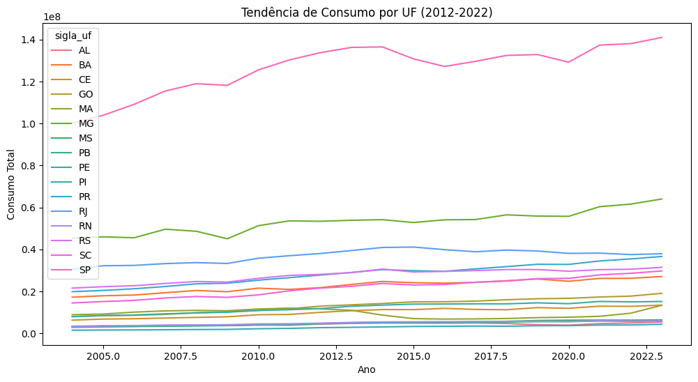

O gráfico exibe a tendência de consumo total de energia por unidade federativa (UF) ao longo dos anos (2012-2022), com base no dataset df_final_pnad. Cada linha representa uma UF, distinguida por uma cor associada à sigla_uf, mostrando variações anuais no consumo. O eixo x indica os anos, e o eixo y representa o consumo total, com o título "Tendência de Consumo por UF (2012-2022)" destacando o foco, o gráfico foi exibido diretamente, revelando uma tendência geral de aumento no consumo ao longo do período, com UFs como São Paulo e Rio de Janeiro apresentando valores mais altos e consistentes.

13º Consumo vs. PIB per Capita 

O gráfico exibe a relação entre o IDHM "indice de desenvolvimento Humano" médio e o consumo per capita (média) por unidade federativa (UF) de 2012 a 2022, com base no dataset df_final_pnad. Cada ponto representa uma UF, colorido por região (Norte, Nordeste, Sudeste, Sul, Centro-Oeste) e com tamanho proporcional ao consumo per capita, variando de 50 a 500. O eixo x mostra o IDHM médio, e o eixo y o consumo per capita, com o título "IDHM vs. Consumo per Capita por UF (2012-2022)" destacando o período. UFs como São Paulo (SP) e Santa Catarina (SC), do Sudeste e Sul, aparecem com IDHM mais alto e maior consumo per capita, indicando uma tendência positiva, enquanto a legenda à direita organiza as regiões, confirmando o destaque dessas áreas.

14º Contribuição do Setor de Serviços para o Número de Consumidores
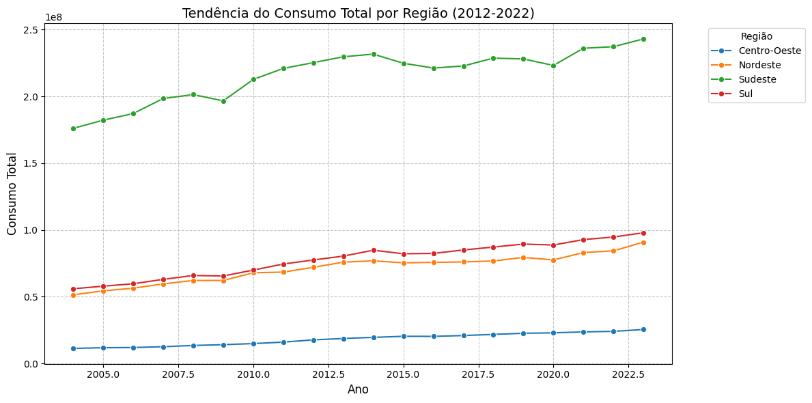

O gráfico exibe a tendência do consumo total de energia por região (Norte, Nordeste, Sudeste, Sul, Centro-Oeste) de 2012 a 2022, com base no dataset df_final_pnad. Cada linha, marcada com pontos e colorida por região, mostra a variação anual do consumo total no eixo y, enquanto o eixo x representa os anos. O título "Tendência do Consumo Total por Região (2012-2022)" destaca o período, e a legenda à direita organiza as regiões. Observa-se uma queda acentuada no consumo em 2020 em todas as regiões, com o Sudeste sofrendo o maior impacto, seguida por uma recuperação parcial em 2021-2022, especialmente nas regiões Sul e Centro-Oeste, conforme indicado pelo comentário. A grade de fundo facilita a comparação entre as linhas.

15º Top UFs por Consumo e Gastos Municipais
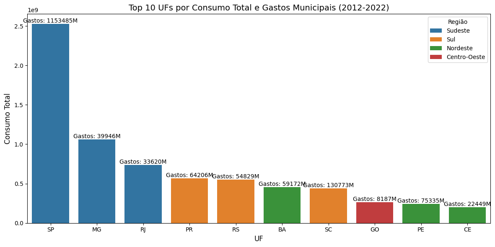

O gráfico de barras exibe os 10 estados com maior consumo total de energia (2012-2022) com base no dataset df_final_pnad, com São Paulo (SP), Rio de Janeiro (RJ) e Minas Gerais (MG) liderando. As barras, coloridas por região (Sudeste, Sul, etc.), mostram o consumo total no eixo y, enquanto o eixo x lista as UFs com rótulos rotacionados. Acima de cada barra, anotações indicam os gastos municipais (MUN_EXPENDIT) em milhões (M), destacando valores altos em SP, RJ e MG. O título "Top 10 UFs por Consumo Total e Gastos Municipais" e a legenda reforçam a análise, sugerindo uma correlação entre consumo e investimento público, conforme o comentário.

##### Ferramentas Sugeridas
O Arquivo em possui um documento requirementes.txt onde demonstram todas a bibliotecas utilizadas no projeto, para possam replicar a utilização.

https://github.com/nerydyego/AED_eletricidade

* Bibliotecas utilizadas
import pandas as pd
import numpy as np
import matplotlib.pyplot as plt
import seaborn as sns
import sys

##### Conclusão

A análise do consumo de energia elétrica no Brasil foi um processo rico em aprendizado, combinando manipulação de dados, visualização e interpretação de resultados. Esta reflexão aborda as etapas realizadas, os desafios enfrentados e as lições adquiridas, incentivando os alunos a documentar suas experiências.
Cada etapa contribuiu para a compreensão do dataset e o desenvolvimento de habilidades analíticas. 
Carregamento e União dos Dados:
-- Descrição: Os datasets de consumo e IBGE foram carregados e mesclados usando pandas, com sigla_uf como chave.
-- Contribuição: Essa etapa ensinou a lidar com dados de fontes distintas, destacando a importância de alinhar colunas e tratar incompatibilidades temporais (ex.: IDHM de 2010 vs. consumo 2012-2022).
-- Habilidade: Manipulação de dados com merge e groupby.
Limpeza de Dados:
-- Descrição: Funções como drop_duplicados e limpa_dados_NAN removeram duplicatas e valores ausentes.
-- Contribuição: Garantiu a integridade dos dados, revelando a necessidade de validação prévia para análises confiáveis.
-- Habilidade: Tratamento de dados ausentes e duplicados.
Visualização e Análise:
-- Descrição: Gráficos como scatter plots, line plots e boxplots foram criados com seaborn e matplotlib para explorar tendências e outliers.
-- Contribuição: Facilitou identificar padrões (ex.: impacto da pandemia) e correlações (ex.: consumidores vs. consumo), reforçando a escolha de visualizações adequadas.
-- Habilidade: Visualização de dados e interpretação contextual.
> Desafios
Incompatibilidade Temporal: O IDHM estático de 2010 pode não refletir mudanças até 2022, introduzindo viés; assumimos representatividade, mas sugere-se atualizar os dados.
Aprendizado: Avaliar a validade temporal é essencial para análises precisas.
Escala de Variáveis: Valores altos de consumo e gastos requereram ajustes (ex.: anotações em milhões) para evitar distorções nos gráficos.
Aprendizado: Normalizar escalas melhora a legibilidade e clareza visual.
Ausência de Regiões: A criação manual de regiao aumentou a complexidade, mas enriqueceu as análises.
Aprendizado: Variáveis derivadas ampliam insights, mas exigem cuidado na implementação.

Este projeto combinou técnicas analíticas com pensamento crítico, apesar de desafios como dados desatualizados. Cada etapa ensinou a importância de rigor e documentação, incentivando os alunos a refletir e aprimorar suas habilidades analíticas.