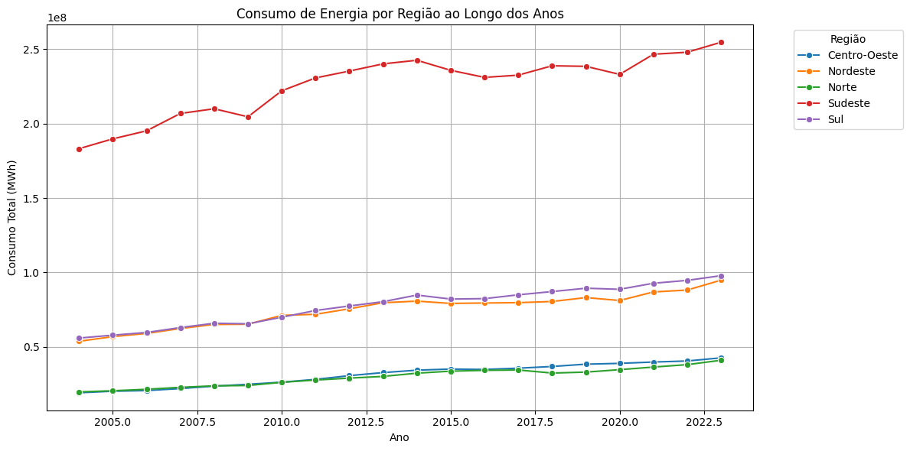
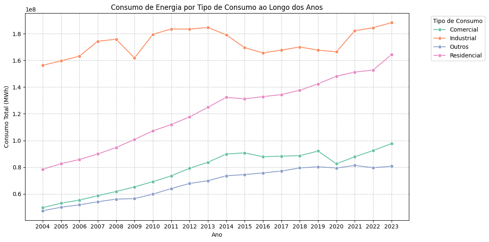
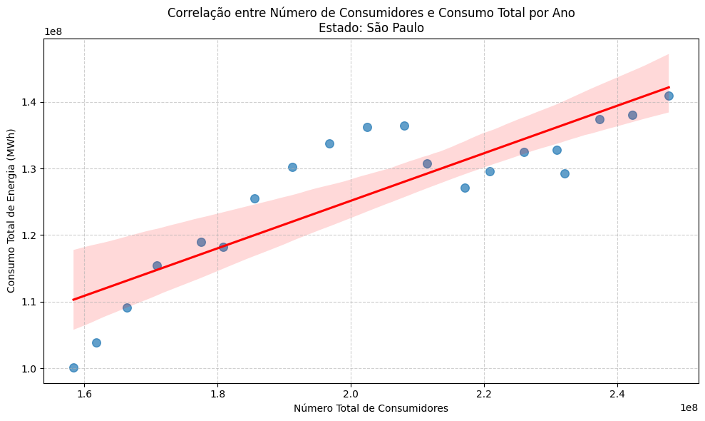
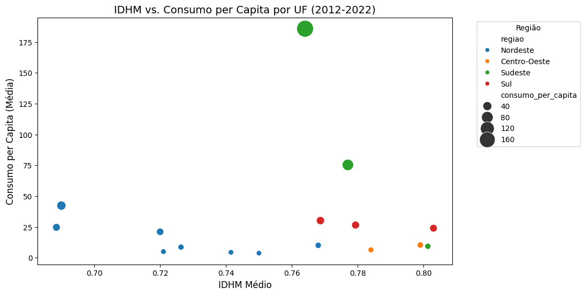
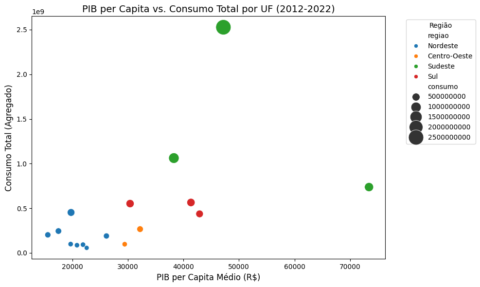
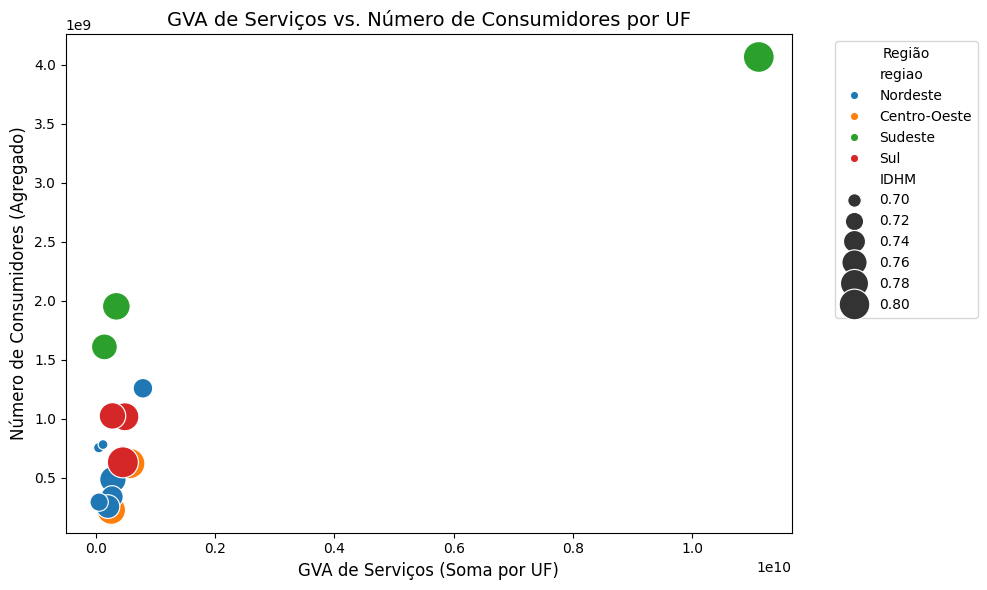

# AED_eletricidade

-----------------------------------------------------------
1º  Evolução do consumo total por ano (nacional) → Gráfico de linha do consumo total por ano.

Obs: O grafico demonstra Como o consumo de energia evoluiu ano a ano no país, Tendências de crescimento ou queda, Anos de estabilidade, crescimento rápido ou crises.

2º Comparação do consumo por região ao longo dos anos → Linha com hue='regiao' vs. ano.

obs: O obejtivo de demonstrar como o consumo de energia evolui em cada região, Qual região tem maior demanda, Possíveis impactos regionais (crises, crescimento econômico, etc.).

3º Consumo médio mensal por região, filtrado por um ano

obs: tem objetivo de demonstrar diferenças sazonais entre regiões (clima, demanda), Meses de pico de consum, Comparação direta entre regiões mês a mês.

4º Tendência de consumo mensal por ano em uma região específica
→ Gráfico de linha ou barras agrupadas.

obs: Este gráfico tem como objetivo apresentar o consumo medio de energia elétrica mensal agrupado por períodos históricos de 5 anos, em uma região específica do país. Ele permite visualizar de forma clara e comparativa como o consumo mensal medio evoluiu ao longo de blocos temporais, mostrando os padrões sazonais e as variações entre diferentes intervalos de tempo.

5º Consumo por tipo de consumo ao longo dos anos

obs: O grafico demonstra a evolução do consumo de energia ao longo dos anos para cada tipo de consumo, assim permitir identificar qual tipo tem maior ou menor consumo, possibilitar detectar mudanças ou tendências específicas por tipo (ex.: aumento no comercial, redução no residencial, etc.).

6º Distribuição do número de consumidores por Região

obs: Permite identificar quais regiões possuem maior ou menor quantidade de consumidores, revelando o padrão regional de consumo de energia elétrica, Auxilia gestores, empresas de energia e órgãos reguladores no planejamento de infraestrutura, investimentos e políticas públicas voltadas para suprimento e eficiência energética. Ao gerar gráficos para anos diferentes, é possível acompanhar o crescimento ou declínio do número de consumidores em cada região ao longo do tempo, detectando tendências e possíveis mudanças demográficas ou econômicas.Facilitar a identificação das regiões com maior demanda por energia, possibilitando direcionar recursos e esforços para áreas que precisam de maior atenção.

7º Correlação entre número de consumidores e consumo total por estado

obs:Cada ponto representa um estado, mostrando o total de consumidores vs consumo total, A linha vermelha indica a tendência geral (regressão linear), Ajuda a identificar se estados com mais consumidores realmente apresentam maior consumo, e se essa relação é linear. Visualizar a relação entre o número de consumidores e o consumo total de energia ao longo dos anos em um estado específico, identificando se há uma tendência linear entre essas variáveis.

8º Detecção de outliers no consumo por estado e ano (usando IQR)

obs: Visualizar a distribuição do consumo de energia para um estado e ano específicos, destacando valores atípicos (outliers) que se desviam significativamente do padrão esperado. Isso ajuda a identificar possíveis erros, eventos incomuns ou variações extremas no consumo que merecem investigação detalhada.

9º Estados que mais consomem energia

Obs: tem por objetivo Identificar os maiores consumidores de energia no país em um ano específico, permitindo entender quais estados concentram a maior parte da demanda energética.
Comparar o consumo entre os estados líderes, destacando desigualdades regionais ou padrões econômicos e populacionais que influenciam no uso de energia elétrica. Analisar a concentração do consumo, verificando se poucos estados concentram a maior parte da energia consumida (por exemplo, estados industrializados ou com maior densidade populacional).Auxiliar no planejamento energético, apontando onde há maior necessidade de fornecimento e infraestrutura para suprir a demanda. Servir como base comparativa entre diferentes anos, caso o gráfico seja gerado para mais de um período.

10º Mapa de calor da correlação entre variáveis numéricas (consumo, consumidores)

obs: O grafico de correlação tende a detectar relações fortes ou fracas (positivas ou negativas) entre variáveis, identificar colunas redundantes ou que podem ser preditoras, 
Suportar decisões em modelagem estatística e Machine Learning. no resultado acima apenas a relação consumo e numero de consumidores posuem tendencia de correlação positiva.

11º Relação entre IDHM e Consumo per Capita por UF

Obs: 
Pergunta: UFs com maior IDH têm maior consumo per capita?
Descrição: Calcula o consumo per capita (consumo / IBGE_POP) e verifica sua relação com o IDHM. Espera-se que UFs com maior IDHM (ex.: SP, SC) tenham maior consumo per capita devido a maior renda e educação.

12º Impacto no Consumo por Região

obs: Este gráfico de linhas mostra a tendência anual do consumo total de energia por região do Brasil entre 2012 e 2022.
O objetivo é analisar como o consumo evoluiu ao longo dos anos em cada região, identificando padrões,
quedas ou recuperações no consumo energético regional.
Destaque para a queda geral em 2020, possivelmente relacionada a eventos específicos (ex.: pandemia),
e a forma como as regiões se recuperaram nos anos seguintes.

13º Consumo vs. PIB per Capita 

obs:Este gráfico de dispersão tem como objetivo analisar a relação entre o PIB per capita médio (GDP_CAPITA)
e o consumo total de energia elétrica por Unidade da Federação (UF), no período de 2012 a 2022.
A cor dos pontos indica a região geográfica de cada UF e o tamanho dos pontos representa o volume total de consumo.
O gráfico busca identificar se há uma correlação entre maior renda per capita e maior consumo de energia,
além de destacar disparidades regionais e possíveis outliers — como estados com alto consumo, mas menor PIB per capita.

14º Contribuição do Setor de Serviços para o Número de Consumidores

obs: Este gráfico de dispersão visa analisar a relação entre o valor agregado bruto dos serviços (GVA_SERVICES)
e o número total de consumidores de energia elétrica por Unidade da Federação (UF).
Além disso, o gráfico representa visualmente o IDHM (Índice de Desenvolvimento Humano Municipal) através do tamanho dos pontos,
e a região geográfica (Norte, Nordeste, etc.) pela cor dos pontos.
O objetivo é identificar se estados com maior atividade econômica no setor de serviços também concentram
maior número de consumidores e melhores índices de desenvolvimento humano, permitindo observar padrões regionais
e socioeconômicos entre os estados brasileiros.

15º Top UFs por Consumo e Gastos Municipais

Obs: O objetivo do gráfico é identificar as 10 Unidades Federativas (UFs) com maior consumo total de energia no Brasil entre 2012 e 2022, e comparar esse consumo com os respectivos gastos municipais (MUN_EXPENDIT) no mesmo período. Além de segmentar as UFs por região geográfica, o gráfico permite visualizar diferenciais regionais no consumo de energia e nos investimentos públicos municipais, oferecendo insights sobre a relação entre demanda energética e o volume de recursos públicos gastos.